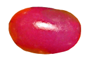

ButonWiggle
===========

A project that makes a custom jellybean button wiggle like it's made of... jelly

This project animates a custom button that uses a picture of a jellybean to make it look like it's wiggling like jelly.

It will either animate a slow, regular change of the horiziontal and vertical and horizontal scale of the button or randomize the motion, based on the setting of the "Use Random Motion" switch.

Non-random animation looks like this:

And randomized animation looks like this:

If yo select random motion, it randomly varies lots of parameters of the animation:

* animation speed
* animation duration for the forward half of the animation
* It rotates the image slightly, by a random angle, and around a random center of rotation.
* It makes the image wider and shorter, or skinnier and taller, by a random amount.
* It then picks a different random duration and animation speed to reverse the animation back to normal
